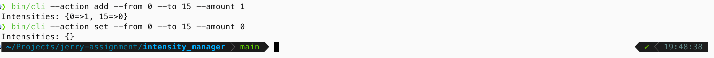
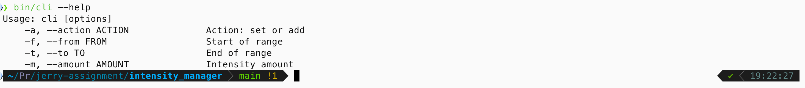
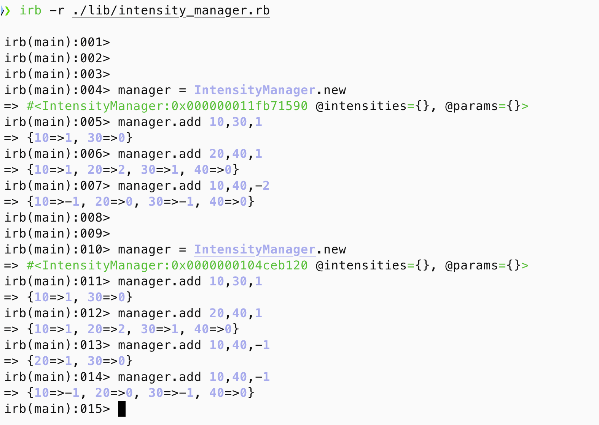
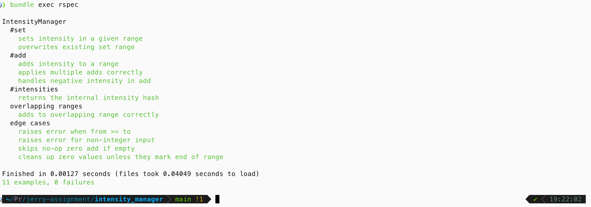

# IntensityManager

`IntensityManager` is a utility class for managing intensities over continuous numeric ranges.

## Features

- Set intensity over a given range
- Add intensity to a range
- View current intensity state
- CLI tool included

## Usage

### Prerequisites
To run this project, ensure you have the following installed on your system:
- [Ruby](https://www.ruby-lang.org/en/downloads/) (>= 2.7 recommended)
- [Bundler](https://bundler.io/) (install via `gem install bundler`)

To verify:

```bash
ruby -v
bundler -v
```

### Ruby API

```ruby
require_relative "lib/intensity_manager"

manager = IntensityManager.new
manager.set(0, 10, 5)
manager.add(5, 15, 3)
puts manager.intensities
```

### Using IRB
Use the Interactive Ruby Shell to run the program:
1. On your local machine open the IRB by typing `irb` in the terminal.
    Ensure you're in the project root and have Ruby installed. Then run:
    ```bash
    irb -r ./lib/intensity_manager.rb
    ```
    After this you can use commands like:
    ```ruby
    manager = IntensityManager.new
    manager.add(0, 5, 3)
    manager.add(5, 15, -1)
    manager.set(3, 10, 1)
    manager.intensities
    ```

2. Alternatively, use an online Ruby compiler/interpreter or better yet online [IRB](https://joshnuss.github.io/mruby-web-irb/).
    Copy and paste the entire code from `lib/intensity_manager.rb`.
    If you're not using IRB, the program will run once like a regular script and exit.

    Add commands like to the end of the code you pasted and run the entire thing:
    ```ruby
    manager = IntensityManager.new
    manager.add(0, 5, 3)
    manager.add(5, 15, -1)
    manager.set(3, 10, 1)
    manager.intensities
    ```

### Using the CLI
Use the CLI to interact with the IntensityManager:

```bash
./bin/intensity_manager
```

Make sure the script is executable:

```bash
chmod +x bin/intensity_manager
```

You'll see an interactive prompt. Example usage:

```bash
> bin/cli --action add --from 0 --to 15 --amount 1
> bin/cli --action set --from 4 --to 7 --amount 3
{0=>1, 4=>3, 7=>1, 15=>0}
```

## Test Coverage
The project includes a comprehensive suite of RSpec tests covering all core functionality and edge cases. 
Here's a breakdown of the tests implemented:

### Running Tests
To run the full test suite:

```bash
bundle exec rspec
```
This runs all specs in spec/intensity_manager_spec.rb, which cover core behavior, edge cases, and range handling.

### Core Functionality
- **`#set`**

    - Sets intensity for a given range.

    - Overwrites an existing intensity range with a new value.

- **`#add`**

    - Adds intensity to a range, modifying existing intervals.

    - Supports multiple sequential adds.

    - Handles negative intensity values.

- **`#intensities`**

    - Returns the internal representation of intensity ranges.

### Overlapping Ranges
- Adds to a range that overlaps with an existing one and merges them correctly.

### Edge Cases
- Raises error when from >= to.

- Raises error when any input is non-integer.

- Skips zero-intensity adds that don't affect existing intervals.

- Cleans up zero-value ranges unless they define an endpoint.


## File Structure
```bash
.
├── bin/
│   └── intensity_manager   # CLI executable
├── lib/
│   └── intensity_manager.rb
├── spec/
│   └── intensity_manager_spec.rb
├── README.md
└── Gemfile
```

## Demo
Screenshots demonstrating usage will be added here.

### CLI Demo


### CLI Options


### IRB (Interactive Ruby Shell) Options


### Test Suite
